---
## Author
author:
  name: Пыхтеева Маргарита Ивановна
  degrees: DSc
  orcid: 0000-0002-0877-7063
  email: 1032252597@rudn.ru
  affiliation:
    - name: Российский университет дружбы народов
      country: Российская Федерация
      postal-code: 117198
      city: Москва
      address: ул. Миклухо-Маклая, д. 6
 
## Title
title: "Лабораторная работа №8: Поиск файлов. Перенаправление ввода-вывода. Просмотр запущенных процессов"
subtitle: "Отчет выполнения лабораторной работы №8"
license: "CC BY"
---
 
# Цель работы
 
Ознакомление с инструментами поиска файлов и фильтрации текстовых данных.Приобретение практических навыков: по управлению процессами (и заданиями), по проверке использования диска и обслуживанию файловых систем.
 
# Задание
 
1. Осуществите вход в систему, используя соответствующее имя пользователя.
2. Запишите в файл file.txt названия файлов, содержащихся в каталоге /etc. Допи-
шите в этот же файл названия файлов, содержащихся в вашем домашнем каталоге.
3. Выведите имена всех файлов из file.txt, имеющих расширение .conf, после чего
запишите их в новый текстовой файл conf.txt.
Кулябов Д. С. и др. Операционные системы 59
4. Определите, какие файлы в вашем домашнем каталоге имеют имена, начинавшиеся
с символа c? Предложите несколько вариантов, как это сделать.
5. Выведите на экран (по странично) имена файлов из каталога /etc, начинающиеся
с символа h.
6. Запустите в фоновом режиме процесс, который будет записывать в файл ~/logfile
файлы, имена которых начинаются с log.
7. Удалите файл ~/logfile.
8. Запустите из консоли в фоновом режиме редактор gedit.
9. Определите идентификатор процесса gedit, используя команду ps, конвейер и фильтр
grep. Как ещё можно определить идентификатор процесса?
10. Прочтите справку (man) команды kill, после чего используйте её для завершения
процесса gedit.
11. Выполните команды df и du, предварительно получив более подробную информацию
об этих командах, с помощью команды man.
12. Воспользовавшись справкой команды find, выведите имена всех директорий, имею-
щихся в вашем домашнем каталоге.
 
 
# Выполнение лабораторной работы
 
Осуществила вход в систему заранее, используя соответствующее имя пользователя.
Записала в файл file.txt названия файлов, содержащихся в каталоге /etc. Дописала в этот же файл названия файлов, содержащихся в вашем домашнем каталоге.([рис. @fig-001]).
 
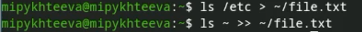{#fig-001 width=70%}
 
Вывела имена всех файлов из file.txt, имеющих расширение .conf.([рис. @fig-002]).
 
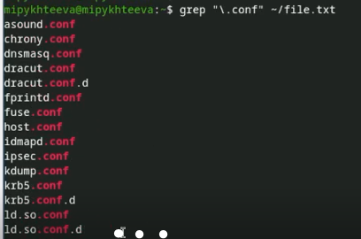{#fig-002 width=70%}
 
После чего записала их в новый текстовой файл conf.txt.([рис. @fig-003]).
 
{#fig-003 width=70%}
 
Определила, какие файлы, начинавшиеся с символа c, находятся в моем домашнем каталоге.  ([рис. @fig-004]).
 
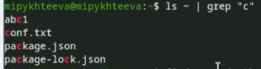{#fig-004 width=70%}

Также предложила несколько вариантов, как еще по-разному это сделать.([рис. @fig-005]).
 
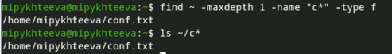{#fig-005 width=70%}
 
Вывела на экран (по странично) имена файлов из каталога /etc, начинающиеся с символа h.([рис. @fig-006]).
 
{#fig-006 width=70%}
 
Сами файлы([рис. @fig-007]).
 
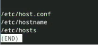{#fig-007 width=70%}
 
Запустила в фоновом режиме процесс, который будет записывать в файл ~/logfile файлы, имена которых начинаются с log. Также удалила файл ~/logfile.([рис. @fig-008]).
 
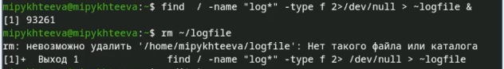{#fig-008 width=70%}
 
Запустила из консоли в фоновом режиме редактор gedit. Определила идентификатор процесса gedit - 93312, используя команду ps, конвейер и фильтр grep. ([рис. @fig-009]).
 
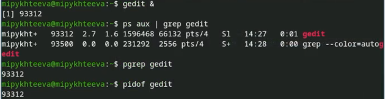{#fig-009 width=70%}
 
Прочла справку (man) команды kill, после чего использовала её для завершения процесса gedit.([рис. @fig-010]).
 
{#fig-010 width=70%}
 
Также проверила завершен ли процесс gedit. ([рис. @fig-011]).
 
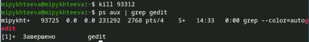{#fig-011 width=70%}
 
Выполнила команды df, предварительно получив более подробную информацию, с помощью команды man.([рис. @fig-012]).
 
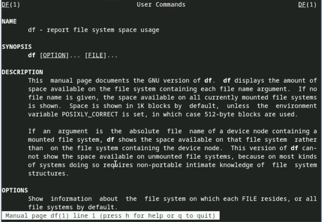{#fig-012 width=70%}
 
Выполнение команды df -h.([рис. @fig-013]).
 
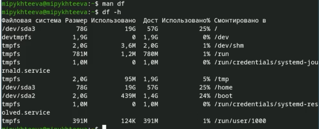{#fig-013 width=70%}
 
Выполнила команды du, предварительно получив более подробную информацию, с помощью команды man.([рис. @fig-014]).
 
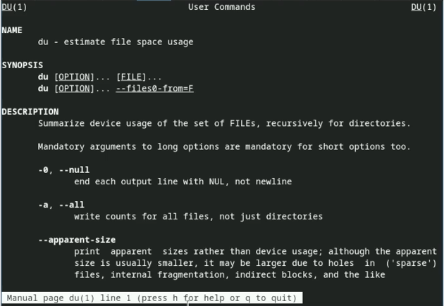{#fig-014 width=70%}
 
Выполнение команды du -h ~.([рис. @fig-015]).
 
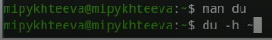{#fig-015 width=70%}
 
Воспользовавшись справкой команды find, вывела имена всех директорий, имеющихся в домашнем каталоге.([рис. @fig-016]).
 
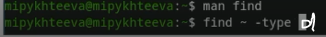{#fig-016 width=70%}
 
# Выводы
 
Ознакомилась с инструментами поиска файлов и фильтрации текстовых данных.Приобрела практические навыки: по управлению процессами (и заданиями), по проверке использования диска и обслуживанию файловых систем.
 
 
# Список литературы{.unnumbered}
 
::: {#refs}
:::
